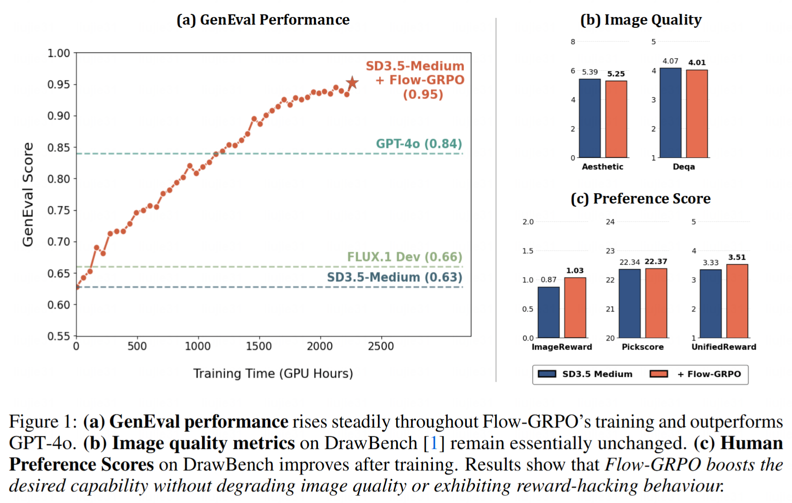

# Flow-GRPO

This is an official implementation of Flow-GRPO: Training Flow Matching Models via Online RL.



## Installation
```bash
git clone https://github.com/yifan123/flow_grpo.git
cd flow_grpo
conda create -n flow_grpo python=3.10.16
pip install -e .
```

## Reward
The steps above only install the current repository. However, RL training requires different rewards, and each reward model might depend on some older pre-trained models. It's difficult to place all of these into a single Conda environment without version conflicts. Therefore, drawing inspiration from the ddpo-pytorch implementation, we use a remote server setup for some rewards.

### OCR
Please install paddle-ocr:
```bash
pip install paddlepaddle-gpu==2.6.2
pip install paddleocr==2.9.1
pip install python-Levenshtein
```
Then, pre-download the model using the Python command line:
```python
from paddleocr import PaddleOCR
ocr = PaddleOCR(use_angle_cls=False, lang="en", use_gpu=False, show_log=False)
```

### GenEval
Please create a new Conda virtual environment and install the corresponding dependencies according to the instructions in [(WIP) LLaVA-server](https://github.com/yifan123/LLaVA_server).

## Usage
Single-node training:
```bash
bash scripts/single_node/main.sh
```
Multi-node training:
```bash
# Master node
bash scripts/multi_node/main.sh
# Other nodes
bash scripts/multi_node/main1.sh
bash scripts/multi_node/main2.sh
```

## Important Hyperparameters
You can adjust the parameters in `config/dgx.py` to tune different hyperparameters. An empirical finding is that `config.sample.train_batch_size * num_gpu / config.sample.num_image_per_prompt * config.sample.num_batches_per_epoch = 48`, i.e., `group_number=48`, `group_size=24`.
Additionally, setting `config.train.gradient_accumulation_steps = config.sample.num_batches_per_epoch // 2` also yields good performance.

## Acknowledgement
This repo is based on [ddpo-pytorch](https://github.com/kvablack/ddpo-pytorch) and [diffusers](https://github.com/huggingface/diffusers). We thank the authors for their valuable contributions to the AIGC community. Special thanks to Kevin Black for the excellent *ddpo-pytorch* repo.